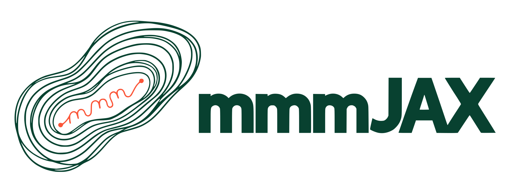

<style>
  .md-typeset h1 {
    position: absolute;
    width: 1px;
    height: 1px;
    padding: 0;
    margin: -1px;
    overflow: hidden;
    clip: rect(0, 0, 0, 0);
    white-space: nowrap;
    border: 0;
  }
  .md-content__button {
    display: none;
  }
</style>

# mmmJAX

<p align="center" style="margin-top: 40px; margin-bottom: 40px;">
  
</p>

mmmJAX is a library for Bayesian marketing mix modeling in
[JAX](https://docs.jax.dev/). It borrows the shape of a
[Stan](https://mc-stan.org/) program. A model is a sequence of named blocks,
each a plain Python function or dictionary, and the blocks together state
what the data is, what is being estimated, how the pieces combine, what the
log density is, and what to compute from each draw. Because the model is
written out rather than assembled from options, you can read every prior and
every structural assumption in the same place you would change it.

The blocks are ordinary JAX code, so the finished model can be differentiated,
compiled, and vectorized, and mmmJAX supplies the marketing-specific pieces
that go inside them. Adstock and saturation functions, seasonal features,
Gaussian process baselines, data preparation with fitted scaling, a Stan-style
distribution library, a NUTS sampler, and tools for response curves and budget
allocation are all available, and none of them are required.

## Installation

mmmJAX is in alpha and requires Python 3.12 or later. Install the development
version from GitHub with your preferred tool.

::::{tab-set}

:::{tab-item} Install with pip

```bash
pip install "git+https://github.com/jordandeklerk/mmmJAX.git"
```

:::

:::{tab-item} Install with uv

```bash
uv add "git+https://github.com/jordandeklerk/mmmJAX.git"
```

:::

::::

JAX runs on the CPU by default. For GPU sampling, install the JAX wheel for
your accelerator first, following the
[JAX installation guide](https://docs.jax.dev/en/latest/installation.html),
and mmmJAX will use it without further configuration.

## Program blocks

A model is built from up to six blocks, given to {class}`~mmmjax.Model` in the order they
run. This skeleton shows all of them with their bodies left as comments. Each
function asks for what it needs by argument name, and mmmJAX supplies it from
the prepared data, the outputs of earlier blocks, or the parameter draws.

```python
import mmmjax as mj

data = mj.prepare_data(frame, time="week", outcome="sales", media=channels)


def transformed_data(media, controls):
    # fixed calculations on the data, evaluated once
    return {...}


parameters = {
    # each name paired with a declaration such as mj.Positive(dims="channel")
}


def transformed_parameters(media, centered, coefficient, retention):
    # derived quantities shared by the two blocks below
    return {...}


def log_density(outcome, mu, coefficient, retention, sigma):
    # priors and likelihood, added one term at a time
    return target


def generated_quantities(key, outcome, mu, sigma):
    # predictions and pointwise terms computed from each draw
    return {...}


model = mj.Model(
    data,
    transformed_data,
    parameters,
    transformed_parameters,
    log_density,
    generated_quantities,
)
```

Only `parameters` and `log_density` are required. Data-only work runs once,
the density runs on every evaluation, and generated quantities run once per
retained draw. Parameters are declared with their constraints and named axes,
and each declaration owns the transform to the unconstrained scale and its
Jacobian adjustment, so every block sees parameters on their natural scale and
the log density contains only the terms you wrote.

## Distributions

Every prior and likelihood term comes from a Stan-style distribution library
built on TensorFlow Probability. Each family has a summed log density for use
in `log_density`, a pointwise version for likelihood diagnostics, a random
draw function, and log cumulative and log survival functions where they exist.
They are plain JAX functions, so they broadcast, differentiate, and compile
like any other.

```python
import jax
import mmmjax as mj

term = mj.gamma(values, shape=2.0, rate=0.5)
gradient = jax.grad(mj.gamma)(values, shape=2.0, rate=0.5)
draws = mj.gamma_rng(jax.random.key(0), shape=2.0, rate=0.5, sample_shape=(1000,))
```

## Inference is separate from the model

A {class}`~mmmjax.Model` does not know how it will be fit. It exposes {meth}`~mmmjax.Model.log_density` for an
unconstrained position, {meth}`~mmmjax.Model.initialize_random` for a starting point, and
{meth}`~mmmjax.Model.constrain` to map draws back to the parameter scale, and that is the whole
interface a sampler needs. The log density is an ordinary JAX function, so its
gradient is one transformation away.

```python
position = model.initialize_random(jax.random.key(0))
value, gradient = jax.value_and_grad(model.log_density)(position, model.data)
parameters = model.constrain(position)
```

The built-in {func}`~mmmjax.sample` uses this interface to run NUTS with window adaptation
and returns an xarray `DataTree` labeled with your data's coordinates, with
the sampler state stored alongside so {func}`~mmmjax.continue_sampling` can add draws later.
Any other sampler that accepts a log density and its gradient, in NumPyro,
BlackJAX, or your own code, works with the same object.

## From data to decisions

{func}`~mmmjax.prepare_data` builds the model inputs from a dataframe, with a
grouping column when the same blocks should fit a hierarchical model across
regions or markets. {func}`~mmmjax.check_data` and {func}`~mmmjax.sample_prior`
catch data and prior problems before any fitting. Afterwards,
{func}`~mmmjax.response_curves`, {func}`~mmmjax.media_metrics`, and
{func}`~mmmjax.optimize_budget` turn the posterior draws into response curves,
channel returns, and spending plans, so the uncertainty in the fit carries
through to the decision.

## Where to go next

[Getting Started](getting_started/index) fits a first model end to end. The
[API Reference](api/index) documents every block input, declaration, and
function with worked examples. The
[repository](https://github.com/jordandeklerk/mmmJAX) has the source and the
issue tracker.

<p align="right">
  
</p>

```{toctree}
:hidden:
:maxdepth: 1

self
getting_started/index
user_guide/index
examples/index
api/index
benchmarks
faq
development/index
contributing
changelog
acknowledgements
```
